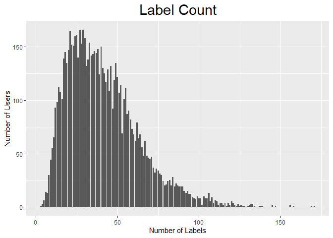

Social Marketing - Identifying Market Segments
================

**Background:** Defined market segments are fundamental for guiding a
marketing strategy and as such, we valued clarity, ease of
communication, and relevance throughout this project. Market
segmentation, in our view, is not just a categorization scheme, but a
basis for action.

While we tried agglomerative hierarchical clustering (since we suspected
that tags like “chatter” might be an umbrella with several
distinct/relevant sub-characteristics) and principal components analysis
(PCA), in order to distill any correlations, we thought that K-means++
conveyed the clearest insights. By use of K-means++, we are able to
discern and characterize 6 distinct market segments that may help inform
the marketing strategy of NutrientH20.

## Pre-Processing

To prune the dataset, we:

  - Deleted records that carried at least one “adult” and one “spam”
    label, judging their credibility to be in question while not
    significantly slashing the size of the dataset
  - Deleted records whose labels were more than 25% “adult,” for both
    credibility and usefulness concerns (our thinking being that
    excessively adult-oriented users are unlikely to inform any useful
    marketing strategy for NutrientH20)
  - Deleted the “spam” feature, since only three records left had a
    single spam label

Overall, we think these steps made a more trustworthy and useful
dataset.

## Market Segments (K-Means++)

**Choosing K:** Our first task was to choose a reasonable number of
clusters. In pursuit of an optimal number, we employed an elbow plot,
the CH-Index, and the gap statistic, all to no avail, so we decided to
just pick one. After some test runs, we settled on 6 clusters that were
most identifiable.

Each cluster is listed below, ordered by size from smallest to largest,
with their eight most common labels and a short description (it should
be noted that “chatter” and “photo-sharing” are in each cluster’s top
8):

#### The Youthful:

Number of users:

    ## [1] 434

Top 8 labels:

    ##                  Label Count Center Value
    ## college_uni             4553    10.490783
    ## online_gaming           4127     9.509217
    ## chatter                 1926     4.437788
    ## photo_sharing           1225     2.822581
    ## sports_playing          1128     2.599078
    ## tv_film                  787     1.813364
    ## health_nutrition         763     1.758065
    ## travel                   675     1.555300

This cluster - the smallest - looks like a young group: concerned with
college, with time to spend on gaming, and energy to spend on playing
sports. At risk of sounding old-fashioned, these traits also appear to
be those traditionally associated with males.

#### The Aesthetic:

Number of users:

    ## [1] 572

Top 8 labels:

    ##                  Label Count Center Value
    ## cooking                 6174    10.793706
    ## photo_sharing           3500     6.118881
    ## fashion                 3180     5.559441
    ## chatter                 2852     4.986014
    ## beauty                  2222     3.884615
    ## health_nutrition        1297     2.267483
    ## shopping                1191     2.082168
    ## current_events          1015     1.774476

This group must be the best-looking: it has very photogenic interests,
and exploits as much, as evidenced by the high ranking of
“photo-sharing.” Their particular affinity for cooking could explain
their interest in NutrientH20. Again risking sounding old-fashioned,
these appear to be traditionally female interests.

#### The Worldly:

Number of users:

    ## [1] 677

Top 8 labels:

    ##               Label Count Center Value
    ## politics             6072     8.968981
    ## travel               3799     5.611521
    ## news                 3605     5.324963
    ## chatter              3084     4.555391
    ## photo_sharing        1725     2.548006
    ## computers            1671     2.468242
    ## automotive           1592     2.351551
    ## sports_fandom        1365     2.016248

Dominated by politics, travel, and news, this group is probably full of
subscribers to the New York Times and \#wanderlust hashtags.

#### The Domestic:

Number of users:

    ## [1] 755

Top 8 labels:

    ##               Label Count Center Value
    ## sports_fandom        4446     5.888742
    ## religion             3968     5.255629
    ## food                 3457     4.578808
    ## chatter              3208     4.249007
    ## parenting            3061     4.054305
    ## school               2036     2.696689
    ## photo_sharing        1984     2.627815
    ## family               1889     2.501987

This seems to be a fairly conservative group of people, focused much
more on close-to-home issues. Hilariously, as much as they post about
family, parenting, and religion, their sports team is second-to-none.

#### The Healthy:

Number of users:

    ## [1] 884

Top 8 labels:

    ##                  Label Count Center Value
    ## health_nutrition       10621    12.014706
    ## personal_fitness        5687     6.433258
    ## chatter                 3863     4.369910
    ## cooking                 2896     3.276018
    ## outdoors                2413     2.729638
    ## photo_sharing           2351     2.659502
    ## food                    1877     2.123303
    ## current_events          1377     1.557692

Not surprisingly, followers of NutrientH20 tend to post about
health/nutrition, fitness, cooking, and the great outdoors. This is the
largest cluster of users that don’t belong to…

#### Everybody Else:

Number of users:

    ## [1] 4448

Top 8 labels:

    ##                  Label Count Center Value
    ## chatter                19354     4.351169
    ## photo_sharing          10281     2.311376
    ## current_events          6420     1.443345
    ## shopping                5750     1.292716
    ## health_nutrition        4889     1.099146
    ## travel                  4859     1.092401
    ## politics                4526     1.017536
    ## tv_film                 4466     1.004047

Finally, this cluster - by far the largest - looks like somewhat of a
hodgepodge of characteristics, dominated by generic traits like
“chatter” and “photo sharing.” It admittedly seems like a cop-out to
call them “everybody else” when we’re trying to identify
characteristics; however, this cluster is distinguished by one thing in
particular:

## Frequent vs. Infrequent Users

While we don’t have information on how many posts each user posted over
the sample week, we can use the number of labels associated with them as
a proxy, assuming the number of labels per individual post is fairly
invariant across users. Here is the distribution of
labels:

<!-- -->

For each cluster, we divided the total number of labels by the number of
users to obtain average labels per user. All 5 of our minority clusters
average around 60 labels per user – on the higher end of the above
distribution. The sixth and largest cluster averages around 28, which is
where we see the largest mass of users in the distribution. We interpret
that to mean that frequent posters are more likely to convey tendencies
than less frequent posters (and are more engaged with Twitter itself).
K-means++ diligently sorted out the trends it could confidently find
from frequent posters and apparently sorted the less frequent posters
into their own cluster.

## Conclusion

While it might be initially frustrating that our largest cluster seems
to lack actionable distinctions, we think that patterns shown by users
who display a high engagement with Twitter are highly valuable, and
possibly represent latent behaviors of our less frequent posters. By
targeting the revealed patterns of minority, high-frequency users -
whether they are young, fashionable, worldly, domestic, or
health-conscious - NutrientH20 may yet increase the engagement of
Everybody Else.
